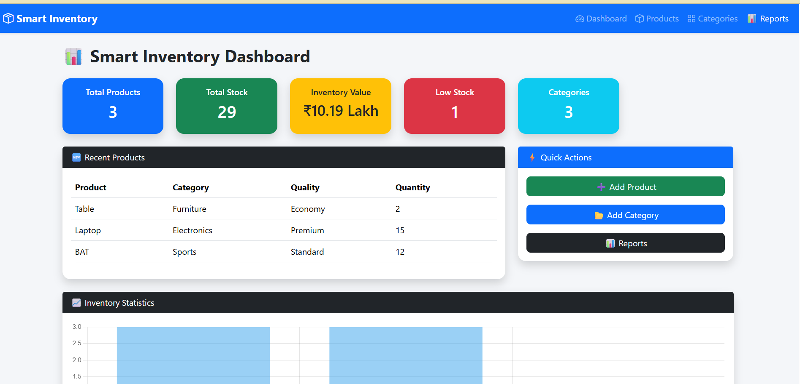
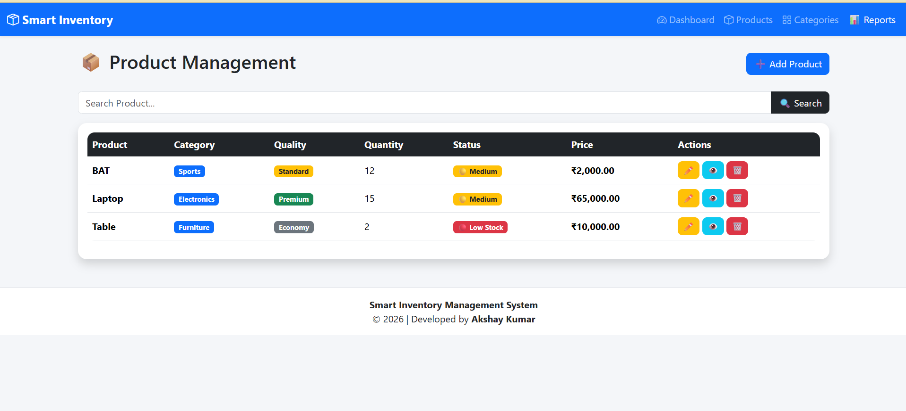
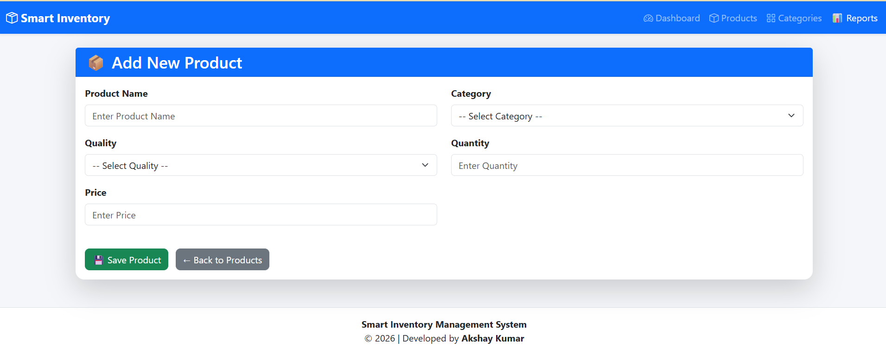
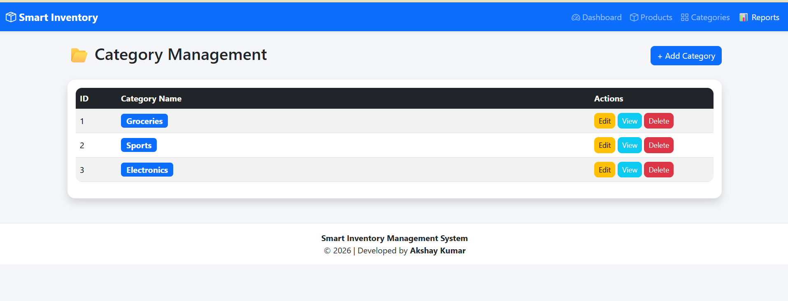
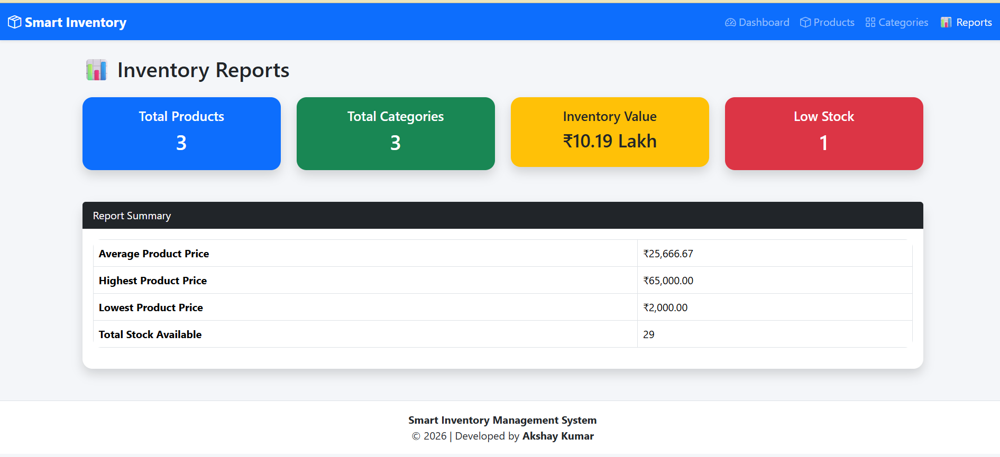

# 📦 Smart Inventory Management System

<div align="center">

### A Modern Inventory Management Web Application Built with ASP.NET Core MVC

Manage products, categories, inventory levels, and business insights through an intuitive dashboard with real-time statistics and interactive charts.


</div>

---

# 📖 Overview

The **Smart Inventory Management System** is a responsive full-stack web application developed using **ASP.NET Core MVC** and **Entity Framework Core**.

It helps businesses efficiently manage products, categories, inventory stock, and inventory analytics through a modern dashboard and an intuitive user interface.

The project demonstrates practical implementation of the **MVC Architecture**, **CRUD Operations**, **Database Integration**, **Entity Framework Core**, **Bootstrap**, and **Chart.js**.

---

# ✨ Key Features

## 📊 Dashboard

* Real-time Inventory Statistics
* Total Products
* Total Categories
* Total Stock
* Inventory Value
* Low Stock Indicator
* Recent Products
* Interactive Chart.js Dashboard

---

## 📦 Product Management

* Add Product
* Update Product
* Delete Product
* Product Details
* Product Search
* Quantity Tracking
* Product Quality Classification

---

## 📂 Category Management

* Add Category
* Edit Category
* Delete Category
* Product Categorization

---

## 📈 Reports

* Inventory Overview
* Product Statistics
* Dashboard Summary

---

## 🎨 User Experience

* Responsive Bootstrap 5 Design
* Professional Dashboard
* Modern UI Components
* Color-coded Stock Status
* Mobile Friendly

---

# 🛠️ Technology Stack

| Technology                 | Purpose             |
| -------------------------- | ------------------- |
| ASP.NET Core MVC (.NET 10) | Web Framework       |
| C#                         | Backend Development |
| Entity Framework Core      | ORM                 |
| SQL Server                 | Database            |
| Bootstrap 5                | Responsive UI       |
| Chart.js                   | Data Visualization  |
| HTML5                      | Frontend            |
| CSS3                       | Styling             |
| JavaScript                 | Client-side Logic   |
| Git                        | Version Control     |
| GitHub                     | Source Code Hosting |

---

# 🏗️ Project Architecture

```
SmartInventoryManagement
│
├── Controllers
├── Models
├── Views
├── Data
├── Migrations
├── wwwroot
│
├── Program.cs
├── appsettings.json
└── SmartInventoryManagement.csproj
```

---

# 📸 Application Screenshots

## Dashboard



---

## Product Management



---

## Add Product



---

## Categories



---

## Reports



---

# 🚀 Getting Started

## Clone Repository

```bash
git clone https://github.com/Akshaykumar1222/SmartInventoryManagementSystem.git
```

## Open Project

Open the solution using **Visual Studio 2022**.

## Configure Database

Update your SQL Server connection string inside:

```
appsettings.json
```

## Apply Database Migrations

```powershell
Update-Database
```

## Run the Project

Press **F5** or click **Start** in Visual Studio.

---

# 📌 Current Modules

* ✅ Dashboard
* ✅ Products
* ✅ Categories
* ✅ Reports
* ✅ Search Functionality
* ✅ Inventory Statistics

---

# 🚀 Future Enhancements

* 🔐 User Authentication (ASP.NET Core Identity)
* 👥 Role-Based Authorization
* 📤 Export Reports to Excel
* 📄 Export Reports to PDF
* 📧 Email Notifications
* ☁️ Cloud Deployment
* 📱 REST API
* 🌙 Dark Mode
* 📈 Advanced Analytics
* 🔔 Automated Low Stock Alerts

---

# 📚 Learning Outcomes

This project demonstrates practical knowledge of:

* ASP.NET Core MVC
* Entity Framework Core
* SQL Server
* CRUD Operations
* MVC Architecture
* Dependency Injection
* LINQ Queries
* Bootstrap UI Development
* Dashboard Design
* Chart.js Integration
* Git & GitHub

---

# 👨‍💻 Author

**Akshay Kumar**

**GitHub**

https://github.com/Akshaykumar1222

**LinkedIn**

https://www.linkedin.com/in/akshay-kumar-532251280/

---

# ⭐ Support

If you found this project useful, consider giving it a ⭐ on GitHub.

It helps support the project and encourages future improvements.
